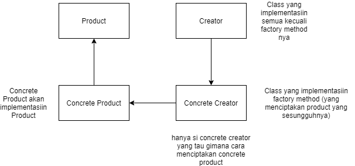

# Factory Pattern
Kita akan analogikan Warung Pecel di Jakarta dan Tegal, dimana mereka jualan Ayam atau Bebek sebagai variannya, dan bahan Ayam kampung untuk di Tegal dan ayam pejantan untuk di Jakarta.

## Diagram

## Notes
Prinsip-prinsip simplenya Factory Pattern :
1. Encapsulate Object Creation
2. Loose coupling, mengurangi dependency ke concrete class
3. Simple Factory : decouple concrete class
4. Factory Method : based on inheritance, tujuannya biar object creation ada di subclass
5. Abstract Factory : based on composition, tujuannya bikin korelasi antara objek yang berhubungan tapi ga bergantung ke concrete class nya